# Blog: AR-T

**Russell Brady**

My blog can be found at https://art38319873.wordpress.com/
The blog was maintained throughout the project on Wordpress.

## The Journey Begins

This is the start of a long process! I am looking forward to the challenge that lies ahead of me.  By this stage I have my supervisor on board – Monica Ward, and I am delighted to have her backing with my project idea. As well as this I had my Project Proposal last week where my project idea was approved.

At this point I am looking into Augmented Reality tech and how I can use it to do what I am looking to do. As well as this I am currently thinking out the structure of my projects and the components I am going to need.

At this point, all the focus is on researching the idea and creating a functional spec to reflect what I hope to achieve in the project.

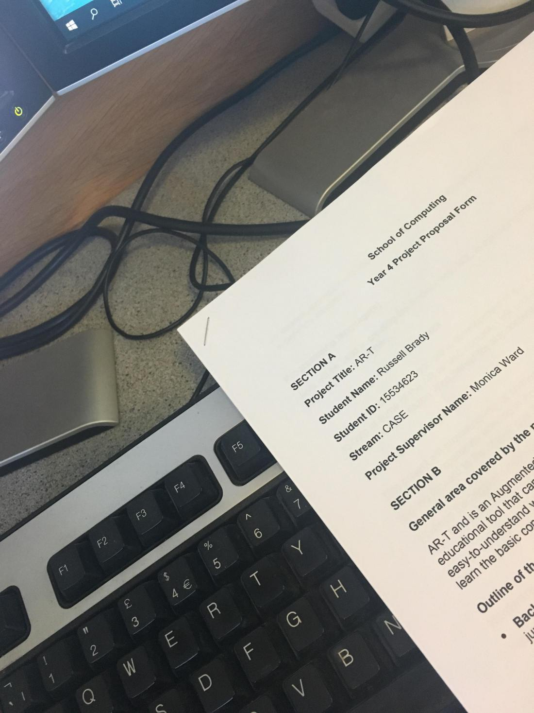

## The Idea

So the question is…what is AR-T? Well AR-T is an Augmented Reality Learning App to be used as an educational tool for teaching Technical Graphics to students in a more practical and comprehensible way.

My aim is to create an app which helps students learn the basic concepts as well as helping them visualise 3-D object and their representation in projections by creating them in the real world using Augmented Reality.

As well as this, there is a very practical side to the app. This will be an app for both students and teachers where teachers can create a class and add their students to it. From here the teacher can assign work to the students, they complete the work and can post a finished photo for the teacher to see and mark. The student will be able to keep a collection of images of their completed drawings.

In the longer run, it would be great to be able to guide students through drawings step-by-step but this is something I am not particularly worried about at the minute.

## Git and CI Integration

Over the last few days I have been focused on setting up my environment for the project. I already had my project cloned locally but I needed to integrate my Android Studio project with Git. Android Studio has a great system which works with Git and allows you to carry out a range of Git functions without having to use the command line. I managed to get this working but it wasn’t as straightforward as you might think. As well as this commits from Android Studio are pushing changes to the root directory and not to the Src folder where all my code should be so this issue still needs to be resolved.

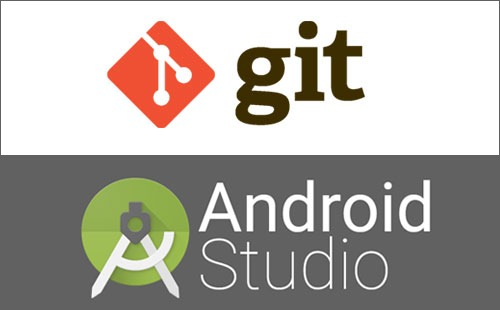

As well as this I wanted to get my CI environment up and running before I started coding as this meant I could continually test my code and as I made changes and commits. I set up my CI environment to run my Android gradle builds as well as any unit tests. Currently the DCU Gitlab CI environment is not working but it is my hope that my CI should work once this is fixed.

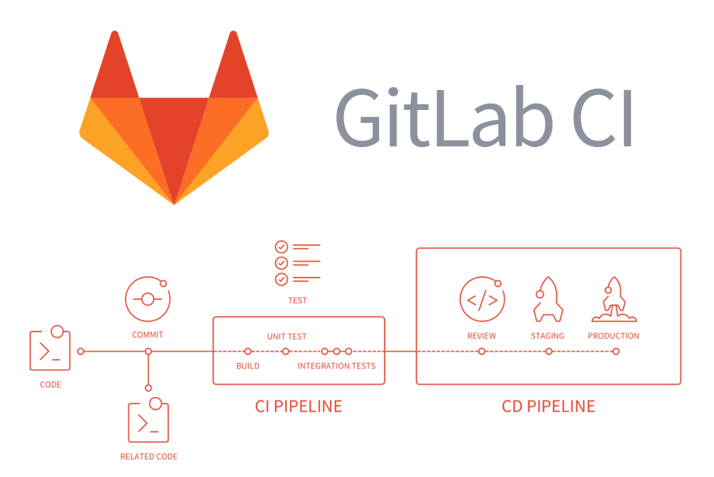

## CI Environment up and running!

This morning I had a breakthrough with getting my CI up and running. With some guidance from a member of staff in the computing building I managed to get my gradle builds and tests executing on Gitlab.

I had to point my image to the dockerfile provided by the school of computing and from here all the relevant installations were already available so I just had to run my scripts then.

It is great to have my CI working from such an early stage as it allows me to develop code knowing I have the back-up of my testing environment behind me. Currently I am running gradle debug and unit tests but I would also like to incorporate code coverage tests at some point also.

## Functional Spec & Initial Project Code

This morning I managed to get my functional spec fully drafted. I have just sent it off to Monica for her to look at give feedback. It is a great feeling to have the functional spec completed as it leaves you in a great position going forward, now knowing your system architecture and design as well as the necessary timeline to follow to complete the project.

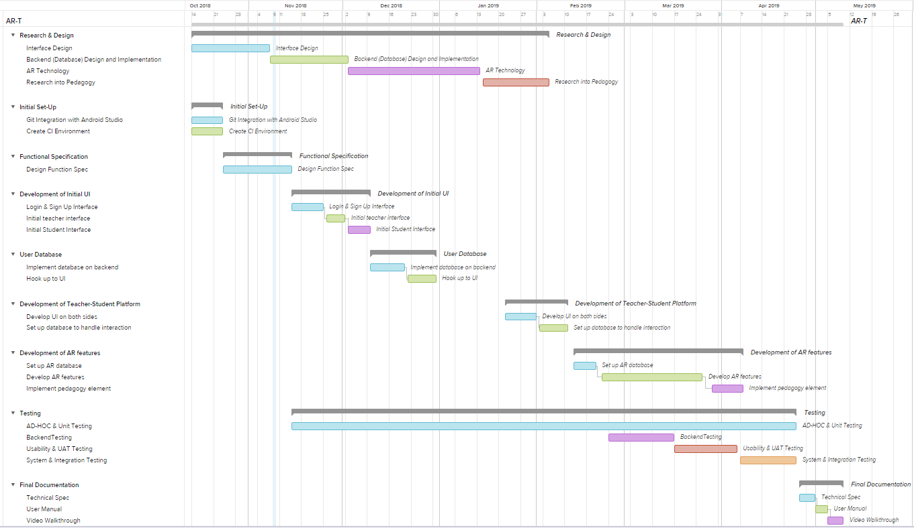

Once I had finished designing my system architecture in the functional spec, I began work on developing my initial code base. I set up the relevant architecture for the login and am now looking at setting up the backend database. I will run the database on localhost to get it running and will then later deploy. It is great to have a head start on the code. Interesting times ahead…..

## Project Meeting With Monica & Database creation and Integration

Yesterday I met up with Monica and the rest of the students being supervised under her. Everyone gave an update as to how they were getting on with regards the project and it was great to be able to get a sense of where everyone is at and their thoughts on the project. I feel like I am currently in a great place as I have my functional spec completed and ready for submission. I have also a start on coding the project which I think is a great benefit at this early stage. Monica seems pleased with how progress is going. Here are my meeting notes….I hope you can read them..because I can’t!!

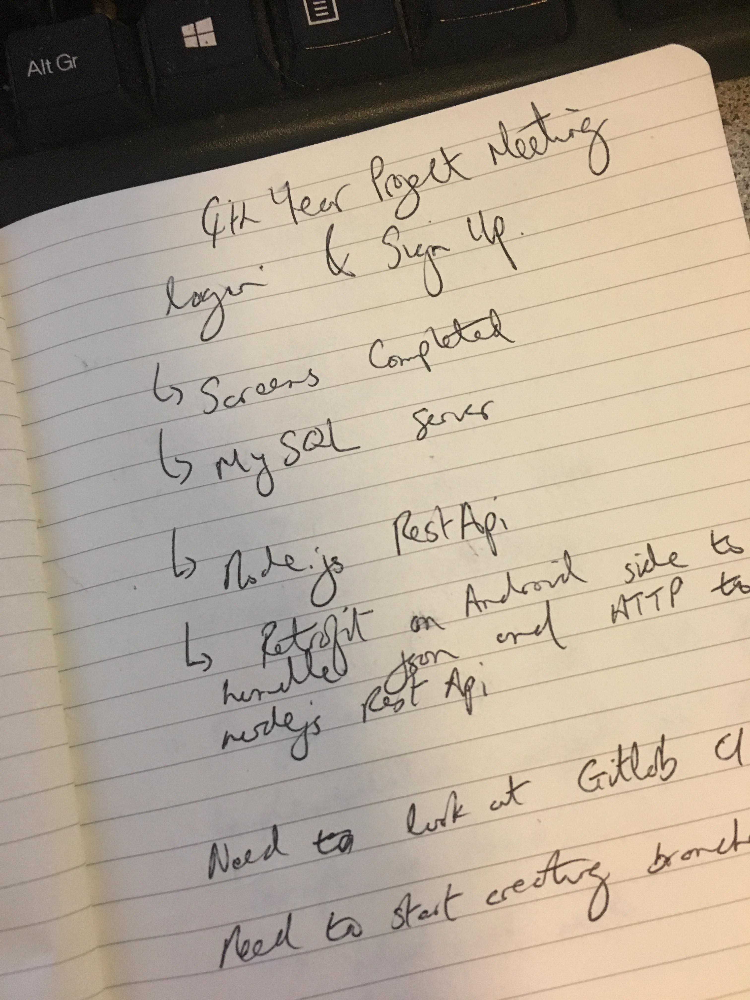

I have started work on my backend database and rest api. I decided to go with a MySQL database to hold my users and their data and will use a Node.js rest api to access the database on the server side. The Android app will interact with the rest api and then it will in turn make CRUD requests to the database. I am really enjoying working with javascript as it is something I haven’t used before. I am now successfully interacting between my rest api and the database and I’m currently working on making the connection between the android app and the rest api. Hopefully it won’t be too difficult!

The whole process is very enjoyable and I am learning a lot as I delve deeper into the project.

## Gitlab Issue Board & Functional Spec

As the weeks begin to roll into the end of semester I find myself trying to get as much done before exams as possible to ease the burden next semester. I have the login and signup screens fully implemented with full support from the backend rest api and database.

As of today my functional spec has been submitted and uploaded to Git. I am very pleased with how it turned out and it really helped me to plan out the app and its components. Monica reviewed the spec and gave me some advice and pointers regarding it which Is much appreciated considering she is on the other side of the world at the minute!

I have also just set up an issue board on Gitlab this evening and it is already coming in very useful. My initial development has some bugs and tech debt which need to be handled and I have also created issues for the next two issues I plan on looking at implementing. Over the coming days I hope to create more issues and them to the board to give myself a clearer view of what needs to be done. The initial issue board can be seen below

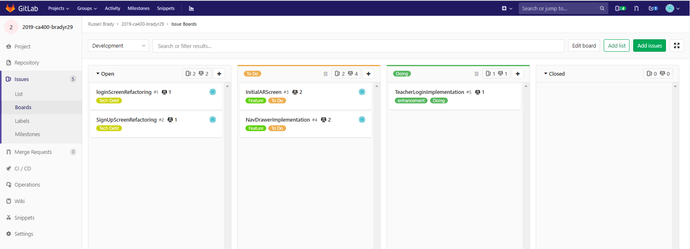

## Cloud Anchor Implementation & Project Meeting

The last number of days I have spent trying to implement cloud anchors in the app. A cloud anchor is basically an anchor for a 3-D space which can be shared between multiple users (multiple devices sharing the same 3-D space). To say the process was tricky is an understatement! It involved generating an anchor id and storing it in my database and then resolving this anchor id from the database to allow multiple users access the same id.

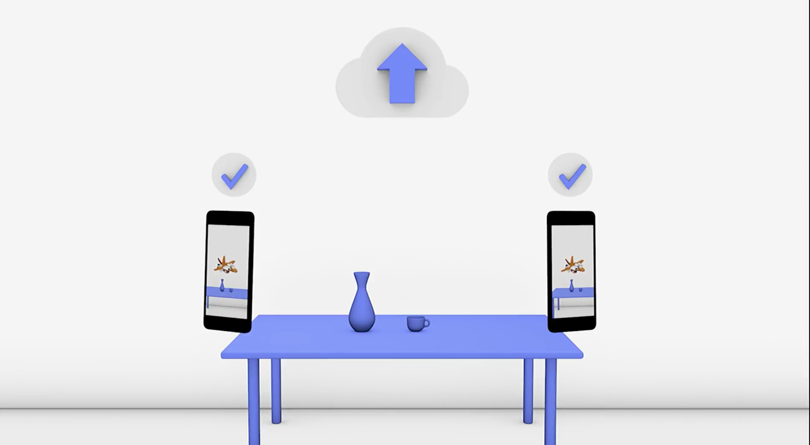

I also met Monica and her other supervised students last Thursday for a meeting to catch up on what we have been doing and how we are getting on. I am happy with progress but feel I need to now start looking more closely at the pedagogy element of the app and how I can use AR to provide a great learning experience.

## Starting up again after Christmas exams

Just a quick check-up after the exam period. It has been over a month since I have looked at the project due to assignments near the end of the semester and then exams after Christmas but I am now looking forward to putting a huge emphasis on the project over the coming weeks.

There is still a lot of work to be done in the app. I have some sample AR objects working in the app to try and get a feel for the technology (which I have found difficult) however it is now time to work on the development of AR experiences which will aid in the learning of Technical Graphics and the underlying concepts.

I also have to finish work on the Teacher / Student interface but this is not of high priority currently as the AR element of the app is of most importance. I am looking forward to the challenge which lies in front of me however developing the AR has proved tricky up to this point and I don’t expect it to be easy over the coming weeks.

I hope to meet with Monica next week when we are back in college to get some advice and guidance but I feel like I am in a good place going forward.

## Project meeting and general progress

Today I had my first meeting with Monica since before Christmas. I asked for this one-to-one meeting to get her opinion on how I was progressing and where I should go from here. I gave Monica a quick overview as to where the project is at and she gave me some great feedback. Although I am coming to terms with the AR technology, she relayed the point that I need to now start looking at it’s applications in the subject and how I can use it to give a great learning experience.

I have spent the past few days developing a feature of the app which will detect certain images and then overlay video on these images. The use case for this would be if the app was accompanying a book, video played through AR is my app could be used to provide extra information on the subject topic or picture.  This was difficult to implement as it involved using OpenGL directly however it was the only way I could create videos in Augmented Reality.

On Saturday last I spent most of the day trying to implement the same feature using Unity but after hours of trying I eventually realised it wasn’t going to be possible and I would have to work with OpenGL directly.

Following the meeting I have drafted some ideas as to where I can further put AR to use. The technology is proving to be more difficult to learn and use than I had anticipated but I guess this is all part of the process.

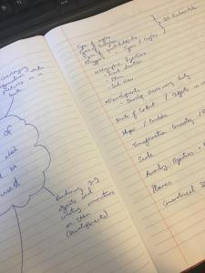

## Unit Testing has commenced
Last night I started unit testing of the app. After working on some features during the day, my plan was to set aside some time to start testing.

Although I am nowhere near finished the app I felt it necessary to start testing at this point as all too often it is left until the very end of projects when there is very little time then allocated for it. A lot of code has already been written and so it is important for me to start testing at this stage while it is still manageable.

I have spent last night and this morning unit testing my login and signup business logic. This mainly involved testing the patterns for the different input fields. I had some trouble mocking and spying classes and upon looking online, it was advised to handle all pattern matching manually so this is what I did. Doing this meant no methods needed to be mocked.

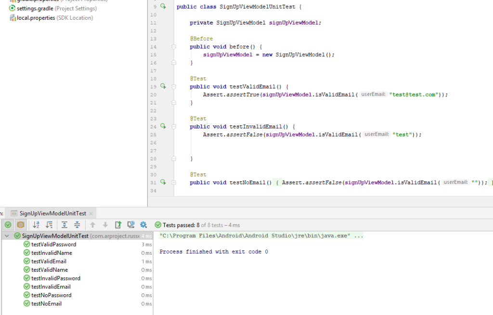

The classes involved in the testing were LoginViewModel and SignUpViewModel. These contain the extracted business logic for their respective Fragments and allows this code to be easily testing using Junit. If this code was to be left in the fragment it would not be reachable by Junit as Fragments are just a view.

I am happy with my start in Unit testing. My next steps in the testing process is to get some User feedback from my Dad who is a former TG teacher. He has years of experience of teaching classes and I hope he can give some good feedback on the app and some advice going forward. Following on from this I will be continuing incremental unit tests over the coming weeks as well as looking into performing espresso testing.

## Progress after week 2 of Second Semester
Progress since the start of the semester has been very promising. Since starting back I have been looking at the teacher – student interface and although correctly implementing the database and integrating it with the rest API and android app has been tricky at times, it is slowly coming together. Starting with the database really helps as the structure is already there then when you go to develop on Android then. Currently I can create classes, assignments and see the students list on the teacher side. Tomorrow I will be working on trying to then view assignments as well as classmates on the student side, as well as uploading work to particular assignments. This is very important as it is a requirement in the app.

I also spent a portion of this morning fixing bugs and adding smaller features. I implemented hashing and salting of passwords as well as refactoring the content loading bar across all fragments and I fixed some orientation problems. Adding swipe to refresh to my recycler views was also a neat little feature.

I am hoping to get as much implemented in the teacher – student interface as possible tomorrow, as come Monday, I will be starting to look at the AR much more closely and trying to implement some of these features.

## Testing Node.js Rest Api
This evening I started testing of my Node.js rest api. Getting the test environment set up for this wasn’t easy and in the end I decided to use the mocha framework. The hardest part of testing the server side code is that it is mainly post and get requests to the database. Creating effective tests for these will be difficult. Also, because I am involving the database, the tests are not as much unit tests as they are integration tests, but they are important all the same.

I am delighted to have started testing my rest api as this means I now have test coverage on both android and server side. As well as this I have my CI in place since the start of the project and I have been receiving feedback on the app from my old TG teacher and my dad (who is a retired TG teacher) so I am very happy with where testing is currently at.

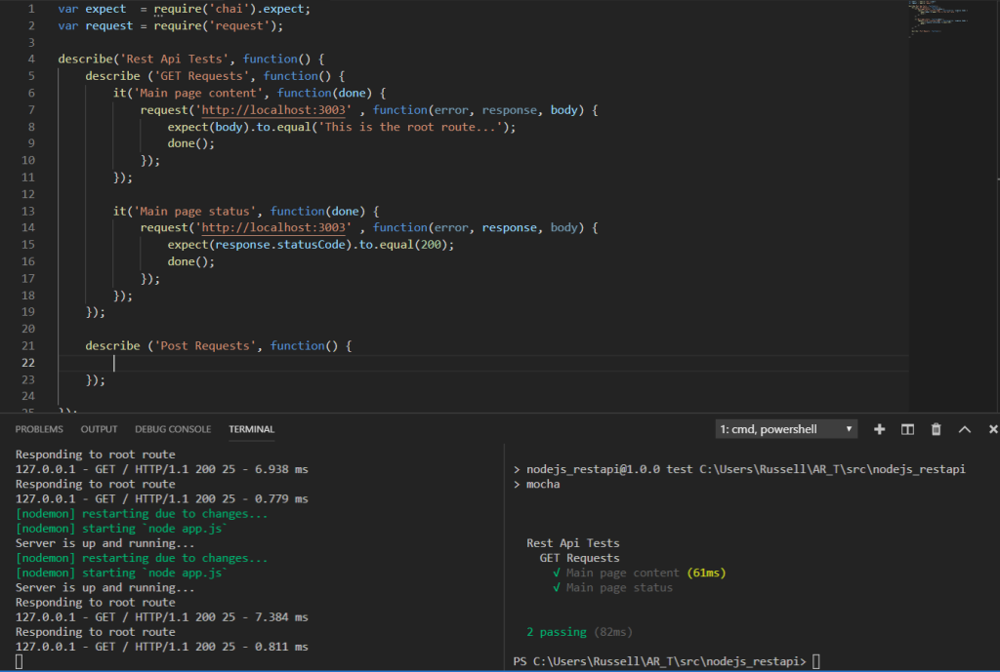

## Classroom interface functionality nearly completed

The classroom which will allow for interaction between teachers and students is nearly complete and I am quite happy with it. There is a lot of work to be done with the UI and adding in some functionality like push notifications or email notifications in different situations as well as handling dates of assignments and some other small issues.

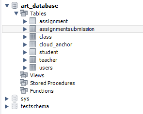

The classroom was not easy to implement as it involved a lot of forward thinking on the database side. The database is where I started first and a picture of the tables as of now can be seen above. From here I set up my rest api to interact between the android app and the database to. On the android side I then set up a UI to reflect the information on the database side (classes, assignments, submissions etc) along with functionality to push new content.

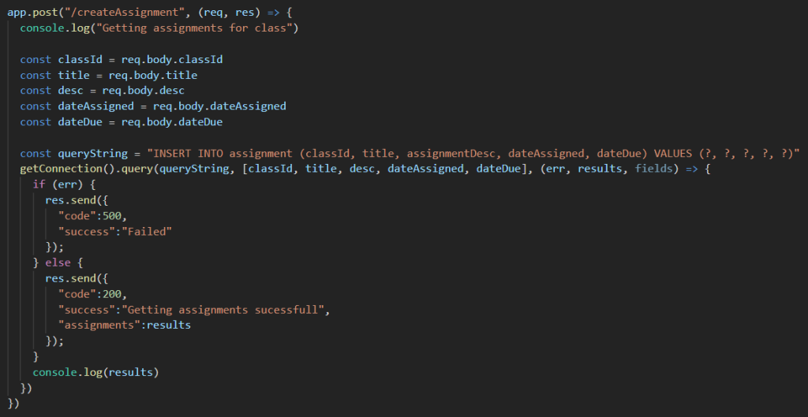

The picture above shows the code which is used by my node.js rest api to create an assignment for example. A POST is made from the android app to the rest api which gathers the relevant information from the body of the request and inserts it into the database, returning success or failure back to the app for display. As can be seen, I am creating my own SQL queries and I’m not depending on an ORM to handle my queries for me. Although it is more difficult to write SQL directly, I like the flexibility it gives me in interacting with the database.

From here I am going to be looking at the AR side of things in more detail and will leave finishing the classroom on hold for the minute as it is not a priority. I am happy with progress and Monica is also happy with how I am getting on in the last two meeting since Christmas.

## Research Papers on implementing AR in the teaching of Technical Drawing
Over the past few weeks I have been doing some further research on how AR could be best utilised in providing a great learning experience to students. I came across a number of research papers which dealt directly with the subject and the possible uses of AR in its teaching.

Reading these articles gave me great belief in what I am doing as they actually reiterated what I had stated in my project proposal in terms of the possible benefits of AR and how it could be used to really help students, as many struggle with the concepts and 3-D elements at first.

Here are the papers I have read to gain more information on the pedagogy element of teaching of the subject using AR:

https://pdfs.semanticscholar.org/38e3/90ac3f469acdb64f2e220aa5eb56e6d75f86.pdf
https://www.semanticscholar.org/paper/Integration-of-Augmented-Reality-into-the-CAD-Serdar/9c043a2eb252a1981413adfdebd812562ef5a778
https://www.irjet.net/archives/V4/i4/IRJET-V4I4179.pdf
http://www.journaleet.org/index.php/jeet/article/viewFile/59362/46419
https://www.sciencedirect.com/science/article/pii/S1877042813037683
https://ieeexplore.ieee.org/document/7044193
All of these papers have been extremely useful in helping me formulate my ideas and make the intended outcome of my AR experience clearer. Implementing of the AR is still proving difficult but I am working hard to develop these features to the best standard I can.

## Loading AR model from server
Following on from reading some of the research papers on AR in the subject, there was some consensus that teachers and students should be able to model their solidwork objects in AR. I have just implemented a small step towards doing this. I am currently able to grab a model from a specific link online and render it on the device (The big yellow duck !!!).

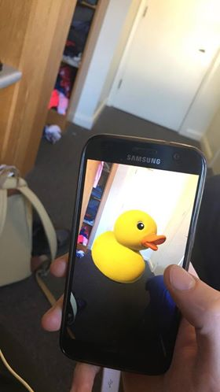

From here I hope to add functionality where teachers and students can upload models they have created on solidworks and they can the view them in AR on the device as well as viewing them together at the same time through the use of cloud anchors.

## UI Testing and Monkey Testing

I spent today setting up some more testing. Following on from my unit testing on both android and node side I wanted to expand my testing to include UI and monkey testing.

I have set up my first few UI tests and I am using the espresso framework. I am hoping to continue with UI testing over the next couple of days and also get up to date with unit testing. As you can see I currently have one test failing in one of my suites but I'm in the process of fixing the error.

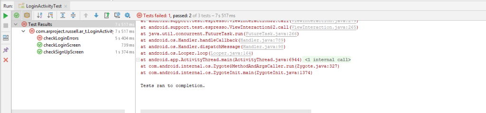

As well as UI testing I also decided to conduct some monkey testing on the app. This involved installing a monkey along with the apk through the commandline which randomly uses the app to stress test it and try to throw up errors. I am using this method to try and simulate first time users interactions with the app and to try and see if it could break with random combinations of interactions. So far I haven't found any bugs which is a good sign but I plan on continuing to utilise this tool in aiding the testing process. Here is the logfile which was returned after conducting the test.

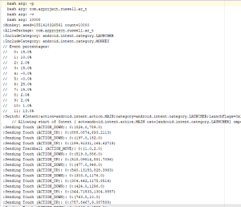

Testing completed to date:

- Continuous Integration Framework Implemented
- Unit Testing (Android)
- Unit Testing (Node)
- UI Testing (Android)
- Monkey Testing (Android)

Testing needed:

- User Testing
- Increased Unit Testing
- Integration Testing with Database
- Stress Testing

## Refactoring Node.js Rest Api

I spent this morning and last night refactoring my Node.js Rest Api. Up to this point I had been adding to an app.js file which managed all my routes and database connections. Before the refactoring the file was approx. 600 lines long and was growing increasingly out of control due to the high dependency on it to handle all routes and connections to the database. Now the app.js file is only 30 lines long with its complexity abstracted out to different classes.

In the refactoring I factored out all of the routes from app.js into appropriate files (e.g. adding login and register routes into their own file). I then used a router to link these files to to the main app.js file. By carrying out this refactoring I reduced the complexity of the Rest Api and split up the dependency.

In carrying out this process I also refactored the connection to the database into its own separate server file which is accessed when necessary. Before the refactoring a new connection was created every time this function was called, however now I have instead implemented a pool which allows us to access the database without creating a new instance every time. A screenshot of the code used to implement this can be seen below:

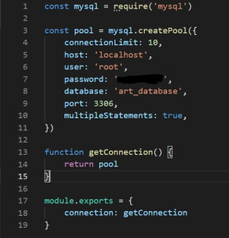

The benefits of this refactoring are the following:

- Reduced complexity
- Increased scalability and maintainability
- Increased testability due to refactoring of database connection into seperate file

## Deployment of application

Over the last couple of days I have worked on deploying my application onto a server. I decided early on that I would use Heroku as my server of choice and this was for a number of reasons.

First of all, Heroku has good support for Node.js applications and also supports add-ons for MySQL databases which is what I needed to correctly deploy my backend. As well as this, I also figured out I was able to deploy to Heroku through my Gitlab CI/CD which meant I would be successfully able to implement continuous deployment.

My first step in the process was to create a Heroku app online. Once this was done I then updated my CI script by adding a production pipeline to allow me to deploy to this Heroku app. Below is a screenshot of my updated CI:

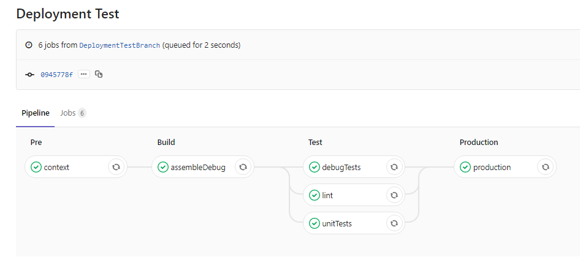

I soon ran into problems however as my Node files were not in the root folder of my project. It couldn’t detect the node files so I had to create a script to direct me to the correct folder to allow Heroku to run the app. As well as this it was having trouble with some of the gradle files from my Android project and Heroku couldn’t distinguish whether it was a Node.js or Android application. I overcame this issue by setting parameters on Heroku to ignore the Android files.

I then had to create a new database instance on my server and after exporting my local database, I imported it into my Heroku database. This was not a straight forward process either however as my heroku database was a different version to my local one. I had to manually change some of the code inside the .sql file (changing the type of encoding UTF8) before I managed to successfully import the database.

After this I then changed the config in my Node server file to point to the new database and once this was done I updated my API client address on the android application to the new address and everything was working fine.

The deployment was a very tricky and tough process as I have never done anything like it before, especially through Gitlab CI however I feel this has been a great learning curve and very worthwhile. Here is a screenshot of the deployment on Heroku.

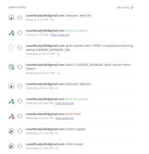

## Cloud Anchors Problems !

For the last few weeks I have been having serious problems with hosting cloud anchors. This was a feature I thought I had implemented properly however a bug in the implementation meant when I hosted the anchor of an object, I was not getting the cloud anchor id back from the server.

I have been stuck on this problem for a considerable length of time however this afternoon I had a breakthrough as the problem was stemming from not properly listening to the response from the server.

There was a lot of debugging involved in solving the issue. I first checked whether there were nulls on the android side when trying to host (there wasn’t), then I checked if the requests were being received on the server side (they were) and finally if the result was being caught on the android side (it wasn’t). From here I then focused on trying to find the root of the problem.

## AR-T Web App up and running

While implementing the AR feature to load models and render them on the device I soon realised that it wouldn’t be practical to have users add models from their phone as generally these types of files are stored on a computer. I spent the last week implementing a web app interface to allow users to upload models for display on the device. I now have a log in screen as well as a simple dashboard up and running which is fit for purpose.

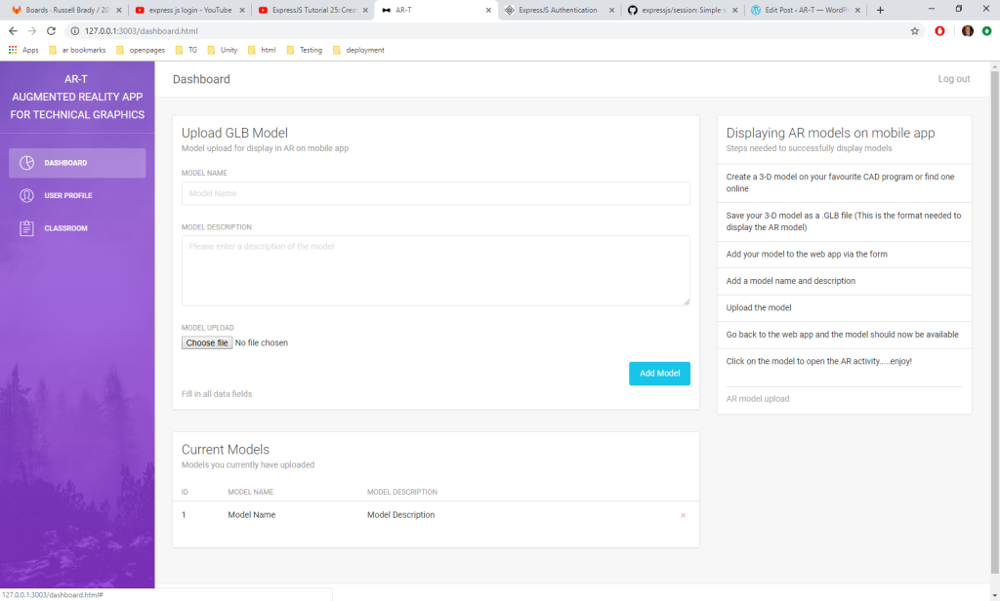

Although a web app was not in the functional spec, it has become a functional requirement. This now also gives me the opportunity to further expand the application however there is only so much I will be able to complete in the scope of this project.

I have also been looking at my issue board and updating it regularly to record progress. I am happy with where I currently stand but there is a lot of work left to be done.

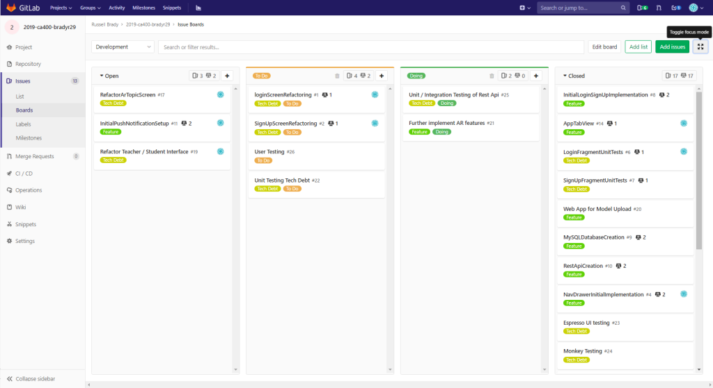

## AR progress

As it stands I have implemented AR functionality where students and teachers can upload their 3-D models they have created and view them in AR on the device. They can also share these 3-D models with each other through the use of clod anchors. As well as this I have functionality working whereby I can view video content in AR. I am currently starting work on animated lessons on different parts of TG.

I have been working closely with my TG teacher and my dad to come up with a suitable set of lessons for students. I am going to have to create and animate my own models to implement for these lesson which is time I hadn’t planned for but I am hoping to get some of that up and running this weekend.

The idea behind showing video content in AR is that the app could be incorporated as a learning resource for a TG school book where certain pictures in the book can play video content. This would give a richer experience for learners.

I am very happy with progress currently however I know there is lots left to do. I am keeping up to date with testing however there is some work to be done in refactoring the UI of the app. I have also uploaded my ethics form for approval so hopefully it will be approved soon and I will be able to make plans for user testing.

## Project Meeting and Demo

Today I met up with Monica along with the other students under her supervision for our weekly project meet up. I gave my update on progress since the previous week and outlined what needs to be done for the upcoming week. Monica was pleased with progress and gave some pointers on areas I should look at trying to improve.

I also demo’d my project to my classmates and Monica. This was the first time I demo’d my project in front of a group of people. It was a nervous experience but was definitely good practice for the real demo. Monica also commented that I was a lot more articulate in presenting than I was when I had first presented to her which is good to hear.

My classmates also enjoyed the app which was pleasing.

I asked for feedback and the main comments which I received were that the 3D models were quite big meaning we needed a lot of space to use the app. I will consider reducing the size of the AR models I am using in order to make using the app easier.

## User Testing and Usability Testing in Secondary School

Today I visited Cnoc Mhuire Granard Secondary School where I conducted user testing with two different teachers and a number of students.

I went into the school where I met the teachers and was introduced to the students. The various plain language statements and consent forms were dealt with and then I started the user testing. First I introduced the teachers to the app and stepped them through the various features. The feedback was very positive and they both thought that the various features in the app were very beneficial to students.

One of the teacher is also a construction technology teacher and he commented that there was huge potential for the app to be used in that subject. He said that various constructions like roofs could be explained using AR models through my app. This feedback is invaluable.

I also asked the teachers how they like the design of the app. One of the teachers commented that the app was very ‘Googley’ – meaning it closely resembled a normal android app. This was fantastic to hear as I tried to closely follow material design principles.

I then got a number of first year students to use the app and interact with the various features. I wanted their feedback in particular to the AR lessons and ask them if they found them useful in understanding the concepts which the lessons were trying to teach. The students found the lessons very useful and were intrigued by the AR technology and seemed very engaged in the lessons. These students filled out anonymous questionnaires on my laptop to record their feedback.

I will take the feedback and use it to better the app. This has been a very worthwhile experience and it was great to get some real world users to test the app.

## Integration Testing

After what has been a long time deliberating and trying to figure out how I should best integration test the application I finally decided on a solution. I decided to export the current database schema and create a new test database with this schema (To be a copy of the real database). I then set up a test environment on my Rest Api which is created when running the tests. On this test environment, the application points to the test database instead of the real one, meaning my real database isn’t exposed during testing.

I then created integration tests using Supertest, Mocha and Chai. These tests cover all the database routes of the Rest Api. These tests are essential in verifying the integrity of these routes while saving the real database from being filled with test data.

## Tracking Lessons in the database

I am now tracking lessons completed by the user in the database. This is very useful as their progress is available to both themselves and their teacher. This involved setting up a student lesson table which maps the student id to the lessons they have completed. On the app the student can now see the lessons they have completed in their user profile as well as the text on the lessons changing to ‘Redo’.

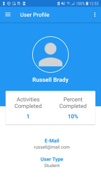

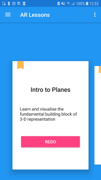

On the teacher side they can now see a students progress on completing the lessons as well as being able to see all the assignments they have completed.

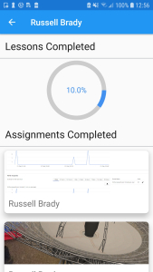

## Added Quizzes

So I have just implemented the final feature of the project – Quizzes. I wanted to introduce quizzes into the app as I felt they were needed to reinforce the learning which had been done in the lessons. At the minute I have 3 quizzes which each have 5 questions. These quizzes are tracked in the database and stores the students scores as they complete the quizzes. Below is a screenshot of one of the quizzes on geometric solids –

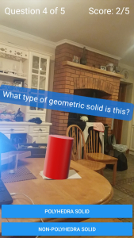

Now that this final feature is completed, I can now focus on refactoring the app and finishing my documentation. I am very happy with my progress at this point and Monica is also happy. I’m looking forward to finishing off my project over the coming weeks and getting the chance to demo it and present it at the project expo.

## Ensuring Database in 3rd Normal Form (3NF)

I spent this morning looking at my database and making sure it was in 3rd normal form. I also wanted to make sure it was in line with the specification I had drawn up in my ER diagram when designing the database. It wasn’t going to look exactly like I had intended due to the addition of extra features like quizzes and cloud anchors, which needed to be trached in the database. For the most part however it complies with what I had intended in the design.

Here is the current ER Diagram as exported straight from MySQL Workbench.

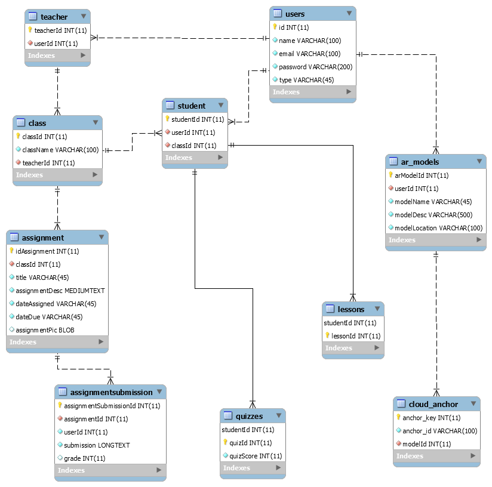

## Notifications

I have added notifications to the app which sends email when certain events happen. When a new assignment is uploaded in a class / student uploads an assignment submission / teacher grades an assignment submission, an email is sent to the appropriate recipient to inform them of it. e.g. email sent to student to notify them of new assignment in the classroom.

Below is the code used to set up the notification server:

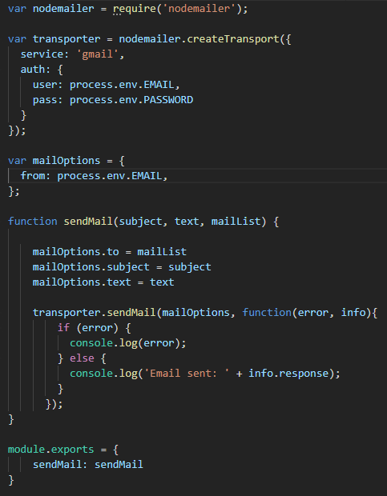

The function sendMail is exported so it can be used anywhere within the app to send an email to a list of emails with a subject and body.

## Project Submission

The day has finally come to submit the final commit to the project. Over the last number of days since finishing exams I have been working on cleaning up my documentation, creating the video walkthrough and fixing any remaining bugs.

I met with Monica yesterday and she was very happy with where the project now stands. We went over the final deliverables and she gave me some feedback which I have taken on board.

Once the final project deliverables are submitted I am looking forward to preparing for the demo on Tuesday and to the Thursday where I will get the chance to show the app at the project Expo.

